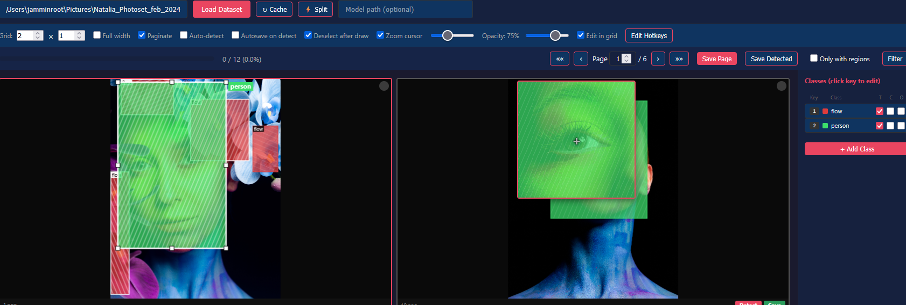

# YOLO Labeler

Browser-based annotation tool for YOLO object detection datasets. Single-file Python backend + vanilla JS frontend, no frameworks or build steps.

 



## Quick Start

```bash
pip install pyyaml opencv-python ultralytics
python server.py
```

Opens `http://localhost:8770` in your browser. Enter a path to your `data.yaml` and start labeling.

## Features

### Annotation
- Draw, move, resize, clone (`Ctrl+Drag`), and delete bounding boxes
- Axis-locked dragging with `Shift`
- Per-class color coding and hotkey binding (a-z, 0-9)
- Zoom cursor (150-350px magnifier follows mouse)
- Visual warnings for overlapping regions, out-of-bounds boxes, and edge-touching regions

### Auto-Detection
- Run a YOLO model on any image directly from the UI
- Configurable model path, auto-save on detect
- Results appear as editable regions

### Dataset Management
- Supports split (`train/val`), flat, and same-folder dataset structures
- Auto-detects structure from `data.yaml`
- Create new datasets, reorganize folders, reshuffle train/val splits
- Auto-fix misaligned YAML paths

### Workflow
- Grid view with configurable layout (1-10 columns/rows) and in-grid editing
- Modal editor for detailed work
- Pagination, filename filtering, progress tracking
- Batch save, auto-save with debounce
- Per-image completion status cached in `.yolo_labeler_cache.json`

## Keyboard Shortcuts

| Key | Action |
|-----|--------|
| `1-9`, `0`, `a-z` | Select class (via hotkey) |
| `Ctrl+Alt+<key>` | Reclassify selected region |
| `Ctrl+Drag` | Clone region |
| `Shift+Drag` | Lock to horizontal/vertical axis |
| `Del` | Delete selected region |
| `Arrow keys` | Nudge region 1px (`Shift` for 5px) |
| `E` / `Enter` | Open modal editor |
| `R` | Run detection |
| `Space` | Save page and go to next |
| `PgUp` / `PgDn` | Navigate pages |

## Dataset Format

Standard YOLO structure:

```
dataset/
  data.yaml
  images/
    train/
      img001.jpg
    val/
      img002.jpg
  labels/
    train/
      img001.txt
    val/
      img002.txt
```

Label files use normalized YOLO format:
```
<class_id> <center_x> <center_y> <width> <height>
```

## Dependencies

- Python 3.8+
- [PyYAML](https://pypi.org/project/PyYAML/)
- [OpenCV](https://pypi.org/project/opencv-python/)
- [Ultralytics](https://pypi.org/project/ultralytics/) (for auto-detection)

## Architecture

Two files:

| File | Role |
|------|------|
| `server.py` | Python HTTP server — serves the UI, reads/writes labels, runs YOLO inference |
| `index.html` | Full SPA frontend — canvas-based editor, grid view, settings, all client-side state |

No database, no build step, no external JS dependencies. Labels are plain `.txt` files on disk.
